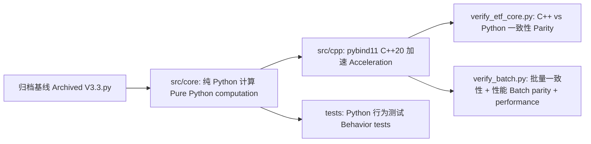

# 形态匹配 ETF 策略 — Python+C++ 混合编程重构 | Pattern Matching ETF Strategy — Python+C++ Hybrid Refactor

[](https://github.com/redamancy231-create/etf-pattern-match-pybind11/actions/workflows/ci.yml)
[](https://www.python.org/)
[](https://en.cppreference.com/)
[](https://cmake.org/)
[](https://github.com/pybind/pybind11)
[](LICENSE)

## 中文 | 中文简介

本项目从 3836 行中文 ETF 形态匹配策略 V3.3 中提取纯计算核心，并使用 **pybind11 + C++20** 进行加速。算法逻辑不变，目标是验证 Python/C++ 混合工程实践——**不是实盘交易系统、不是投资建议、不是策略收益优化**。

**适用场景：** pybind11/C++ 加速实践、量化工程参考、Python/C++ 一致性检验。

**不适用场景：** 实盘交易、投资建议、回测收益声明、策略绩效优化。

## English | English Summary

Pure computation modules were extracted from a 3,836-line Chinese ETF pattern-matching strategy (V3.3) and accelerated with **pybind11 + C++20**. The algorithm logic is unchanged.

**For:** pybind11/C++ acceleration practice, quant engineering reference, Python/C++ parity testing.

**Not for:** live trading, investment advice, new backtest claims, or strategy performance optimization.

## 加速结果 | Acceleration Results

核心函数单次调用加速 43x–58x，批量匹配因 Python/C++ 编排和数据搬运占主导，端到端加速 2.2x。
Core single-call speedups reach 43x–58x, while batch matching reaches 2.2x because Python/C++ orchestration and data movement dominate the end-to-end workload.

| 函数 Function | Python | C++ | 加速比 Speedup |
|------|--------|-----|--------|
| DTW 距离 DTW Distance (L=19) | 125 µs | 2.9 µs | **43x** |
| 形态匹配（单 ETF 单时间点）Pattern Match (single ETF, one timestamp) | 15.3 ms | 0.3 ms | **58x** |
| 批量形态匹配（100 时间点）Batch Pattern Match (100 timestamps) | 50 ms | 23 ms | **2.2x** |

### 基准测试范围 | Benchmark Scope

- 平台 Platform：Windows 11, MSVC Release `/O2`
- Python: 3.12.7
- C++: C++20, pybind11 3.0.4
- 验证 Verification：`python verify_etf_core.py` 与 `python verify_batch.py`
- 范围 Scope：仅计算核心加速，非交易性能声明；compute-kernel acceleration only, not a claim about trading performance

## 快速开始 | Quick Start

```bash
# 编译 C++ 模块 | Compile C++ module
cmake -B build -DPython_EXECUTABLE="<path-to-python.exe>"
cmake --build build --config Release

# 验证 C++ 与 Python 一致性 | Verify C++ vs Python consistency
python verify_etf_core.py

# 运行测试 | Run tests
python -m pytest tests/ -v
```

## 项目结构 | Project Structure

```
├── src/core/                  # Python 纯计算层（6 模块，零掘金 SDK 依赖）
│   │                          # Python pure computation layer (6 modules, zero JuE SDK dependency)
│   ├── dtw.py                  # DTW 距离 + 序列标准化 | DTW distance + sequence standardization
│   ├── pattern_match.py        # 形态匹配引擎（15 维特征）| Pattern matching engine (15-dim features)
│   ├── technical.py            # ADX / ATR / 板块轮动 | ADX / ATR / sector rotation
│   ├── market_features.py      # 市场环境特征 F16-F21 | Market environment features (F16-F21)
│   ├── risk_controls.py        # 风控规则（纯计算）| Risk control rules (pure computation)
│   └── metrics.py              # Sortino / Calmar / IC 统计 | Sortino / Calmar / IC statistics
├── src/cpp/
│   ├── etf_core.cpp            # 统一 C++ 加速模块（7 函数，~1000 行）
│   │                           # Unified C++ acceleration module (7 functions, ~1,000 lines)
│   └── pyi/etf_core.pyi        # 类型存根 | Type stubs
├── tests/                      # 54 项单元测试 | 54 unit tests
├── verify_etf_core.py          # C++ vs Python 一致性验证 | C++ vs Python consistency verification
├── verify_batch.py             # 批量形态匹配验证 | Batch pattern matching verification
└── CLAUDE.md                   # 开发笔记与 pybind11 经验 | Development notes and pybind11 lessons
```



## 常见问题 | FAQ

### 这是交易系统吗？| Is this a trading system?

不是。本仓库是一个编程实践项目：从量化策略中提取纯计算模块，用 pybind11 + C++20 加速，验证一致性。
No. This repository is a programming practice project for extracting pure computation modules and accelerating them with pybind11 + C++20.

### 为什么批量加速（2.2x）远低于单次调用加速（58x）？| Why is batch speedup (2.2x) much lower than single-call speedup (58x)?

单次形态匹配测量的是纯计算热路径。批量匹配包含编排、数据搬运、验证和 Python/C++ 边界开销。预计算窗口缓存有帮助，但端到端吞吐量受这些开销限制。
Single-call pattern matching measures the hot compute kernel in isolation. Batch matching includes orchestration, data movement, validation, and Python/C++ boundary costs. The precomputed window cache helps, but end-to-end throughput is bounded by these overheads.

### 是否依赖掘金 SDK？| Does it depend on the JuE (掘金) SDK?

不依赖。提取出的 `src/core` 是纯计算模块，仅需 NumPy。
No. The extracted `src/core` modules are pure computation modules and only require NumPy.

### 原始 V3.3.py 在哪里？| Where is the original V3.3.py?

原始策略是父项目的归档基线，本仓库仅保留提取出的计算层、测试和 C++ 加速模块——不含完整平台绑定策略。
The original strategy is an archived baseline from the parent Chinese project. This repository keeps the extracted computation layer, tests, and C++ acceleration module — not the full platform-bound strategy.

### 能否重跑原始回测？| Can I rerun the original backtest?

不能。原始 V3.3 是封存基线，依赖掘金平台，不在本仓库范围内。本项目聚焦工程提取、C++ 加速和一致性验证。
No. The original V3.3 is a sealed baseline that depends on the JuE platform and is outside this repository's scope. This project focuses on engineering extraction, C++ acceleration, and parity verification.

## 原始来源与范围 | Original Source and Scope

提取自**形态匹配 ETF 策略 V3.3**（归档基线，3836 行）。原始策略为周频 ETF 多头轮动策略（DTW + 余弦形态匹配 → RF/SVM Stacking → 多层风控），在掘金平台回测，覆盖 2020-2026 年。
Extracted from **Pattern Matching ETF Strategy V3.3** (archived baseline, 3,836 lines). The original strategy is a weekly ETF long-only rotation strategy (DTW + cosine pattern matching → RF/SVM Stacking → multi-layer risk controls), backtested on the JuE platform over 2020–2026.

**本仓库包含 | What this repository contains:**
- 提取的纯计算 Python 模块 `src/core/` | Extracted pure-computation Python modules
- pybind11/C++20 加速模块 `src/cpp/` | pybind11/C++20 acceleration module
- 54 项单元测试 + 2 个验证脚本 | 54 unit tests + 2 verification scripts
- 构建配置与开发文档 | Build configuration and development documentation

**本仓库不含 | What this repository does NOT contain:**
- 原始平台绑定策略文件 | The original platform-bound strategy file
- 掘金 SDK 绑定或实盘交易代码 | JuE SDK bindings or live trading code
- 回测结果或策略绩效声明 | Backtest results or strategy performance claims

## 工具链 | Toolchain

- Python 3.12.7 + NumPy
- pybind11 3.0.4
- MSVC 19.51 (Visual Studio 2026 Community) + CMake 3.20
- C++20

## 模型分工与审查 | Model Responsibilities and Review

| 作者 Author | 交付 Delivery | 审查 Review |
|------|------|------|
| DeepSeek-V4-Pro | 6 个 Python 模块 + C++ 骨架 + 测试 + 文档 | Kimi + GPT-5.5 |
| | 6 Python modules + C++ skeleton + tests + documentation | |
| Kimi-K2.7-Code | C++ `pattern_match_batch` + 全量 GIL 覆盖 + batch 契约收敛 + 边界测试 | GPT-5.5 |
| | C++ pattern_match_batch + full GIL coverage + batch contract convergence + boundary tests | |

所有源文件均标注模型来源。All source files are annotated with model provenance.

## 详细文档 | Detailed Documentation

开发笔记与 pybind11 实战经验：[CLAUDE.md](CLAUDE.md) — 构建细节、ABI 排错、GIL 管理、浮点容差、审查追溯。
Development notes and pybind11 lessons: [CLAUDE.md](CLAUDE.md) — build details, ABI troubleshooting, GIL management, floating-point tolerances, and review traceability.
