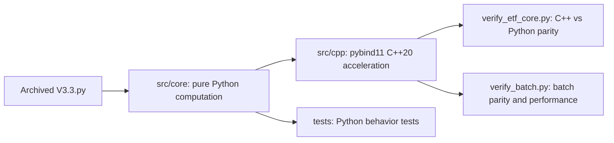

# Pattern Matching ETF Strategy — Python+C++ Hybrid Programming Refactor

[](https://www.python.org/)
[](https://en.cppreference.com/)
[](https://cmake.org/)
[](https://github.com/pybind/pybind11)
[](tests/)
[](LICENSE)

[中文简介](#中文简介) | [English](#english-summary)

## 中文简介

本项目从 3836 行中文 ETF 形态匹配策略 V3.3 中提取纯计算核心，并使用 pybind11 + C++20 进行加速。项目目标是验证 Python/C++ 混合工程实践——**不是实盘交易系统、不是投资建议、不是策略收益优化**。

## English Summary

Pure computation modules were extracted from a 3,836-line Python quantitative ETF strategy and accelerated with **pybind11 + C++20**. The algorithm logic is unchanged.

**For:** pybind11/C++ acceleration practice, quant engineering reference, Python/C++ parity testing.

**Not for:** live trading, investment advice, new backtest claims, or strategy performance optimization.

## Acceleration Results

Core single-call speedups reach 43x–58x, while batch matching reaches 2.2x because Python/C++ orchestration and data movement dominate the end-to-end workload.

| Function | Python | C++ | Speedup |
|------|--------|-----|--------|
| DTW Distance (L=19) | 125 µs | 2.9 µs | **43x** |
| Pattern Matching (single ETF at one timestamp) | 15.3 ms | 0.3 ms | **58x** |
| Batch Pattern Matching (100 timestamps) | 50 ms | 23 ms | **2.2x** |

### Benchmark Scope

- Platform: Windows 11, MSVC Release `/O2`
- Python: 3.12.7
- C++: C++20, pybind11 3.0.4
- Verification: `python verify_etf_core.py` and `python verify_batch.py`
- Scope: compute-kernel acceleration only; not a claim about trading performance

## Quick Start

```bash
# Compile C++ module
cmake -B build -DPython_EXECUTABLE="<path-to-python.exe>"
cmake --build build --config Release

# Verify C++ vs Python consistency
python verify_etf_core.py

# Run tests
python -m pytest tests/ -v
```

## Project Structure

```
├── src/core/                  # Python pure computation layer (6 modules, zero JuE SDK dependency)
│   ├── dtw.py                  # DTW distance + sequence standardization
│   ├── pattern_match.py        # Pattern matching engine (15-dimensional features)
│   ├── technical.py            # ADX / ATR / sector rotation
│   ├── market_features.py      # Market environment features (F16-F21)
│   ├── risk_controls.py        # Risk control rules (pure computation)
│   └── metrics.py              # Sortino / Calmar / IC statistics
├── src/cpp/
│   ├── etf_core.cpp            # Unified C++ acceleration module (7 functions, ~1,000 lines)
│   └── pyi/etf_core.pyi        # Type stubs
├── tests/                      # 54 unit tests
├── verify_etf_core.py          # C++ vs Python consistency verification
├── verify_batch.py             # Batch pattern matching verification
└── CLAUDE.md                   # Development notes and pybind11 lessons
```



## FAQ

### Is this a trading system?

No. This repository is a programming practice project for extracting pure computation modules and accelerating them with pybind11 + C++20.

### Why is batch speedup (2.2x) much lower than single-call speedup (58x)?

Single-call pattern matching measures the hot compute kernel in isolation. Batch matching includes orchestration, data movement, validation, and Python/C++ boundary costs. The precomputed window cache helps, but end-to-end throughput is bounded by these overheads.

### Does it depend on the JuE (掘金) SDK?

No. The extracted `src/core` modules are pure computation modules and only require NumPy.

### Where is the original V3.3.py?

The original strategy is an archived baseline from the parent Chinese project. This repository keeps the extracted computation layer, tests, and C++ acceleration module — not the full platform-bound strategy.

### Can I rerun the original backtest?

No. The original V3.3 is a sealed baseline that depends on the JuE platform and is outside this repository's scope. This project focuses on engineering extraction, C++ acceleration, and parity verification.

## Original Source and Scope

Extracted from Pattern Matching ETF Strategy V3.3 (archived baseline, 3,836 lines). The original strategy is a weekly ETF long-only rotation strategy (DTW + cosine pattern matching → RF/SVM Stacking → multi-layer risk controls), backtested on the JuE platform over 2020-2026.

**What this repository contains:**
- Extracted pure-computation Python modules (`src/core/`)
- pybind11/C++20 acceleration module (`src/cpp/`)
- 54 unit tests + 2 verification scripts
- Build configuration and development documentation

**What this repository does NOT contain:**
- The original platform-bound strategy file
- JuE SDK bindings or live trading code
- Backtest results or strategy performance claims

## Toolchain

- Python 3.12.7 + NumPy
- pybind11 3.0.4
- MSVC 19.51 (Visual Studio 2026 Community) + CMake 3.20
- C++20

## Model Responsibilities and Review

| Author | Delivery | Review |
|------|------|------|
| DeepSeek-V4-Pro | 6 Python modules + C++ skeleton + tests + documentation | Kimi + GPT-5.5 |
| Kimi-K2.7-Code | C++ `pattern_match_batch` + full GIL coverage + batch contract convergence + boundary tests | GPT-5.5 |

All source files are annotated with model provenance.

## Detailed Documentation

Development notes and pybind11 lessons: [CLAUDE.md](CLAUDE.md) — build details, ABI troubleshooting, GIL management, floating-point tolerances, and review traceability.
