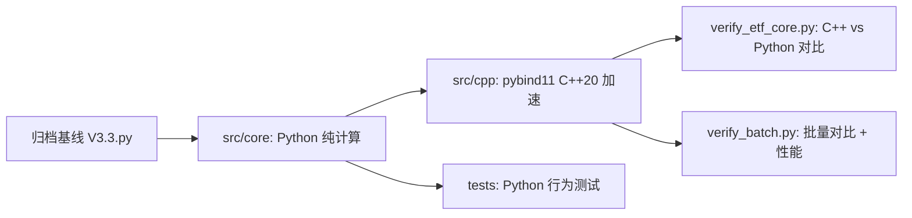

# 形态匹配 ETF 策略 — Python+C++ 混合编程重构

[](https://github.com/redamancy231-create/etf-pattern-match-pybind11/actions/workflows/ci.yml)
[](https://www.python.org/)
[](https://en.cppreference.com/)
[](https://cmake.org/)
[](https://github.com/pybind/pybind11)
[](LICENSE)
[](https://github.com/1c7/chinese-independent-developer)

**语言 / Languages**：简体中文 · [English](en/README.md) · [正體中文](zh-Hant/README.md)

[]()
[](en/README.md)
[](zh-Hant/README.md)

> **English Abstract**: Pure computation modules extracted from a 3,836-line Chinese ETF pattern-matching strategy (V3.3) and accelerated with **pybind11 + C++20**. DTW 34× (96µs→2.8µs), pattern match 53× (14.0ms→0.26ms), batch 2.2× end-to-end. Algorithm logic unchanged — this is a Python/C++ hybrid engineering practice project, not a trading system. 54 tests, 2 verification scripts, interactive Jupyter demo, pip install ready. Full **[English README](en/README.md)** available.

> ⚡ DTW 96µs→2.8µs (34x) | 形态匹配 14.0ms→0.26ms (53x) | pybind11+C++20 | pip install 即用

## 简介

本项目从 3836 行中文 ETF 形态匹配策略 V3.3 中提取纯计算核心，并使用 **pybind11 + C++20** 进行加速。算法逻辑不变，目标是验证 Python/C++ 混合工程实践——**不是实盘交易系统、不是投资建议、不是策略收益优化**。

**适用场景：** pybind11/C++ 加速实践、量化工程参考、Python/C++ 一致性检验。

**不适用场景：** 实盘交易、投资建议、回测收益声明、策略绩效优化。

## 加速结果

核心函数单次调用加速 34x–53x（100 次计时中位数，5 次 warm-up），批量 C++ 单次 ×100 → C++ 批量 ×1 的接口开销缩减 2.2x。可复现基准测试详见 [benchmarks/](benchmarks/)。

| 函数 | Python | C++ | 加速比 |
|------|--------|-----|--------|
| DTW 距离（L=19） | 96 µs | 2.8 µs | **34×** |
| 形态匹配（单 ETF 单时间点） | 14.0 ms | 0.26 ms | **53×** |
| 批量形态匹配（100 时间点） | 50 ms¹ | 23 ms | **2.2×¹** |

> ¹ 批量行比较的是 100 次 C++ 单次调用 vs 1 次 C++ 批量调用——衡量批量接口开销降低，非 Python vs C++ 加速比。

> **详细分析**：单次调用 53× 加速落到批量场景只剩 2.2×——这不是 bug，是 Amdahl's Law。见 [性能分析短文](docs/performance-analysis.zh-CN.md)。可复现基准测试方法见 [benchmarks/](benchmarks/)。

### 基准测试范围

- 平台：Windows 11, MSVC Release `/O2`
- Python: 3.12.7
- C++: C++20, pybind11 3.0.4
- 验证：`python verify_etf_core.py` 与 `python verify_batch.py`
- 范围：仅计算核心加速，非交易性能声明

## 快速开始

**▶️ [交互演示 Notebook](notebooks/etf_pattern_matching_demo.ipynb)** — 在 Jupyter 中逐步体验完整算法流程。

### pip install（推荐）
```bash
pip install git+https://github.com/redamancy231-create/etf-pattern-match-pybind11.git
```

### 从源码构建（cmake）
```bash
# 编译 C++ 模块
cmake -B build -DPython_EXECUTABLE="<path-to-python.exe>"
cmake --build build --config Release

# 验证 C++ 与 Python 一致性
python verify_etf_core.py

# 运行测试
python -m pytest tests/ -v

# 启动交互演示
jupyter notebook notebooks/etf_pattern_matching_demo.ipynb
```

## 项目结构

```
├── src/core/                  # Python 纯计算模块（6 个模块，零掘金 SDK 依赖）
│   ├── dtw.py                  # DTW 距离 + 序列标准化
│   ├── pattern_match.py        # 形态匹配引擎（15 维特征）
│   ├── technical.py            # ADX / ATR / 板块轮动
│   ├── market_features.py      # 市场环境特征（F16-F21）
│   ├── risk_controls.py        # 风控规则（纯计算）
│   └── metrics.py              # Sortino / Calmar / IC 统计
├── src/cpp/
│   ├── etf_core.cpp            # 统一 C++ 加速模块（8 函数，~1,100 行）
│   └── pyi/etf_core.pyi        # 类型存根
├── tests/                      # 54 项单元测试
├── notebooks/
│   └── etf_pattern_matching_demo.ipynb  # 交互演示（GPT-5.6-Sol 审查）
├── verify_etf_core.py          # C++ vs Python 一致性验证
├── verify_batch.py             # 批量形态匹配验证
└── CLAUDE.md                   # 开发笔记与 pybind11 实战经验
```



## 常见问题

### 这是交易系统吗？

不是。本仓库是一个编程实践项目：从量化策略中提取纯计算模块，用 pybind11 + C++20 加速，验证一致性。

### 为什么批量加速（2.2x）远低于单次调用加速（53x）？

单次形态匹配测量的是纯计算热路径。批量匹配包含编排、数据搬运、验证和 Python/C++ 边界开销。预计算窗口缓存有帮助，但端到端吞吐量受这些开销限制。

### 是否依赖掘金 SDK？

不依赖。提取出的 `src/core` 是纯计算模块，仅需 NumPy。

### 原始 V3.3.py 在哪里？

原始策略是父项目的归档基线，本仓库仅保留提取出的计算层、测试和 C++ 加速模块——不含完整平台绑定策略。

### 能否重跑原始回测？

不能。原始 V3.3 是封存基线，依赖掘金平台，不在本仓库范围内。本项目聚焦工程提取、C++ 加速和一致性验证。

## 原始来源与范围

提取自**形态匹配 ETF 策略 V3.3**（归档基线，3836 行）。原始策略为周频 ETF 多头轮动策略（DTW + 余弦形态匹配 → RF/SVM Stacking → 多层风控），在掘金平台回测，覆盖 2020-2026 年。

**本仓库包含：**

- 提取的纯计算 Python 模块 `src/core/`
- pybind11/C++20 加速模块 `src/cpp/`
- 54 项单元测试 + 2 个验证脚本
- 构建配置与开发文档

**本仓库不包含：**

- 原始平台绑定策略文件
- 掘金 SDK 绑定或实盘交易代码
- 回测结果或策略绩效声明

## 工具链

- Python 3.12.7 + NumPy
- pybind11 3.0.4
- MSVC 19.51（Visual Studio 2026 Community）+ CMake 3.20
- C++20

## 模型分工与审查

| 作者 | 交付 | 审查 |
|------|------|------|
| DeepSeek-V4-Pro | 6 个 Python 模块 + C++ 骨架 + 测试 + 文档 | Kimi + GPT-5.5 |
| Kimi-K2.7-Code | C++ `pattern_match_batch` + 全量 GIL 覆盖 + batch 契约收敛 + 边界测试 | GPT-5.5 |

所有源文件均标注模型来源。

## 关联项目

| 项目 | 关系 |
|------|------|
| [**AI 协作框架**](https://github.com/redamancy231-create/ai-collaboration-framework) | **方法论上游**——本项目的多后端审查、被动观测记录、项目闭合协议均源自该框架 |
| [**Independent Review Toolkit**](https://github.com/redamancy231-create/independent-review-toolkit) | **审查方法来源**——本项目的 Kimi + GPT-5.5 四轮异后端审查使用了该工具包的 SOP |
| [**Prompt-TDD Methodology**](https://github.com/redamancy231-create/prompt-tdd-methodology) | **同级项目**——将对照实验方法论应用于 prompt 工程；本项目在 pybind11/C++ 混合编程方向上应用了类似的方法学严谨性 |
| [**M&A Case Study Pipeline**](https://github.com/redamancy231-create/ma-case-study-pipeline) | **同级项目**——多模型学术生产流水线；同样强调方法的可移植性和跨后端验证 |
| [**DOCX Pipeline**](https://github.com/redamancy231-create/docx-pipeline) | **同级项目**——Markdown → 中文 DOCX 泛化管道，双后端 + Mermaid 渲染 |
| [**Claude Skills**](https://github.com/redamancy231-create/claude-skills) | **同级项目**——3 个实战验证的 Claude Code Skill，从真实项目工作流提取 |

## 详细文档

开发笔记与 pybind11 实战经验：[CLAUDE.md](CLAUDE.md) — 构建细节、ABI 排错、GIL 管理、浮点容差、审查追溯。
