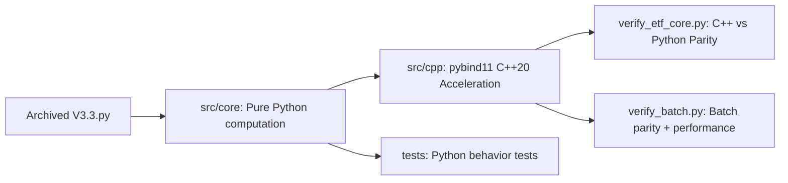

# Pattern Matching ETF Strategy — Python+C++ Hybrid Refactor

[](https://github.com/redamancy231-create/etf-pattern-match-pybind11/actions/workflows/ci.yml)
[](https://www.python.org/)
[](https://en.cppreference.com/)
[](https://cmake.org/)
[](https://github.com/pybind/pybind11)
[](LICENSE)
[](https://github.com/1c7/chinese-independent-developer)

**Languages**: English · [简体中文](../README.md) · [正體中文](../zh-Hant/README.md)

[]()
[](../README.md)
[](../zh-Hant/README.md)

> ⚡ DTW 96µs→2.8µs (34x) | Pattern Match 14.0ms→0.26ms (53x) | pybind11+C++20 | pip install ready

## Summary

Pure computation modules were extracted from a 3,836-line Chinese ETF pattern-matching strategy (V3.3) and accelerated with **pybind11 + C++20**. The algorithm logic is unchanged.

**For:** pybind11/C++ acceleration practice, quant engineering reference, Python/C++ parity testing.

**Not for:** live trading, investment advice, new backtest claims, or strategy performance optimization.

## Acceleration Results

Core single-call speedups reach 34x–53x (median of 100 runs, 5 warm-up), while batch C++ single ×100 → C++ batch ×1 overhead reduction reaches 2.2x. See [reproducible benchmarks](../benchmarks/) for methodology and raw data.

| Function | Python | C++ | Speedup |
|------|--------|-----|--------|
| DTW Distance (L=19) | 96 µs | 2.8 µs | **34×** |
| Pattern Match (single ETF, one timestamp) | 14.0 ms | 0.26 ms | **53×** |
| Batch Pattern Match (100 timestamps) | 50 ms¹ | 23 ms | **2.2×¹** |

> ¹ Batch row compares 100 C++ single calls vs 1 C++ batch call — a measure of batch-interface overhead reduction, not Python-vs-C++ speedup.

> **Detailed analysis**: why 53× single-call speedup becomes 2.2× in batch workloads — not a bug, it's Amdahl's Law. See [performance analysis article](../docs/performance-analysis.md). Reproducible benchmark methodology: [benchmarks/](../benchmarks/).

### Benchmark Scope

- Platform: Windows 11, MSVC Release `/O2`
- Python: 3.12.7
- C++: C++20, pybind11 3.0.4
- Verification: `python verify_etf_core.py` and `python verify_batch.py`
- Scope: compute-kernel acceleration only, not a claim about trading performance

## Quick Start

**▶️ [Interactive Demo Notebook](../notebooks/etf_pattern_matching_demo.ipynb)** — walk through the full algorithm step-by-step in Jupyter.

### pip install (recommended)
```bash
pip install git+https://github.com/redamancy231-create/etf-pattern-match-pybind11.git
```

### Build from source (cmake)
```bash
# Compile C++ module
cmake -B build -DPython_EXECUTABLE="<path-to-python.exe>"
cmake --build build --config Release

# Verify C++ vs Python consistency
python verify_etf_core.py

# Run tests
python -m pytest tests/ -v

# Launch interactive demo
jupyter notebook notebooks/etf_pattern_matching_demo.ipynb
```

## Project Structure

```
├── src/core/                  # Python pure computation layer (6 modules, zero JuE SDK dependency)
│   ├── dtw.py                  # DTW distance + sequence standardization
│   ├── pattern_match.py        # Pattern matching engine (15-dim features)
│   ├── technical.py            # ADX / ATR / sector rotation
│   ├── market_features.py      # Market environment features (F16-F21)
│   ├── risk_controls.py        # Risk control rules (pure computation)
│   └── metrics.py              # Sortino / Calmar / IC statistics
├── src/cpp/
│   ├── etf_core.cpp            # Unified C++ acceleration module (8 functions, ~1,100 lines)
│   └── pyi/etf_core.pyi        # Type stubs
├── tests/                      # 54 unit tests
├── notebooks/
│   └── etf_pattern_matching_demo.ipynb  # Interactive demo (GPT-5.6-Sol reviewed)
├── verify_etf_core.py          # C++ vs Python consistency verification
├── verify_batch.py             # Batch pattern matching verification
└── CLAUDE.md                   # Development notes and pybind11 lessons
```



## FAQ

### Is this a trading system?

No. This repository is a programming practice project for extracting pure computation modules and accelerating them with pybind11 + C++20.

### Why is batch speedup (2.2x) much lower than single-call speedup (53x)?

Single-call pattern matching measures the hot compute kernel in isolation. Batch matching includes orchestration, data movement, validation, and Python/C++ boundary costs. The precomputed window cache helps, but end-to-end throughput is bounded by these overheads.

### Does it depend on the JuE (掘金) SDK?

No. The extracted `src/core` modules are pure computation modules and only require NumPy.

### Where is the original V3.3.py?

The original strategy is an archived baseline from the parent Chinese project. This repository keeps the extracted computation layer, tests, and C++ acceleration module — not the full platform-bound strategy.

### Can I rerun the original backtest?

No. The original V3.3 is a sealed baseline that depends on the JuE platform and is outside this repository's scope. This project focuses on engineering extraction, C++ acceleration, and parity verification.

## Original Source and Scope

Extracted from **Pattern Matching ETF Strategy V3.3** (archived baseline, 3,836 lines). The original strategy is a weekly ETF long-only rotation strategy (DTW + cosine pattern matching → RF/SVM Stacking → multi-layer risk controls), backtested on the JuE platform over 2020–2026.

**What this repository contains:**

- Extracted pure-computation Python modules `src/core/`
- pybind11/C++20 acceleration module `src/cpp/`
- 54 unit tests + 2 verification scripts
- Build configuration and development documentation

**What this repository does NOT contain:**

- The original platform-bound strategy file
- JuE SDK bindings or live trading code
- Backtest results or strategy performance claims

## Toolchain

- Python 3.12.7 + NumPy
- pybind11 3.0.4
- MSVC 19.51 (Visual Studio 2026 Community) + CMake 3.20
- C++20

## Model Responsibilities and Review

| Author | Delivery | Review |
|------|------|------|
| DeepSeek-V4-Pro | 6 Python modules + C++ skeleton + tests + documentation | Kimi + GPT-5.5 |
| Kimi-K2.7-Code | C++ `pattern_match_batch` + full GIL coverage + batch contract convergence + boundary tests | GPT-5.5 |

All source files are annotated with model provenance.

## Related Projects

| Project | Relationship |
|------|------|
| [**AI Collaboration Framework**](https://github.com/redamancy231-create/ai-collaboration-framework) | **Methodology upstream** — multi-model review, passive observation, and project closure protocols originate from this framework |
| [**Independent Review Toolkit**](https://github.com/redamancy231-create/independent-review-toolkit) | **Review methodology source** — the four-round Kimi + GPT-5.5 cross-backend review followed this toolkit's SOP |
| [**Prompt-TDD Methodology**](https://github.com/redamancy231-create/prompt-tdd-methodology) | **Sibling project** — controlled experiment methodology for prompt engineering; this project applies similar methodological rigor to pybind11/C++ hybrid programming |
| [**M&A Case Study Pipeline**](https://github.com/redamancy231-create/ma-case-study-pipeline) | **Sibling project** — multi-model academic production pipeline; shares emphasis on methodology portability and cross-backend verification |
| [**DOCX Pipeline**](https://github.com/redamancy231-create/docx-pipeline) | **Sibling project** — Markdown → Chinese DOCX pipeline with dual backend + Mermaid |
| [**Claude Skills**](https://github.com/redamancy231-create/claude-skills) | **Sibling project** — 3 battle-tested Claude Code Skills extracted from real project workflows |

## Detailed Documentation

Development notes and pybind11 lessons: [CLAUDE.md](../CLAUDE.md) — build details, ABI troubleshooting, GIL management, floating-point tolerances, and review traceability.
