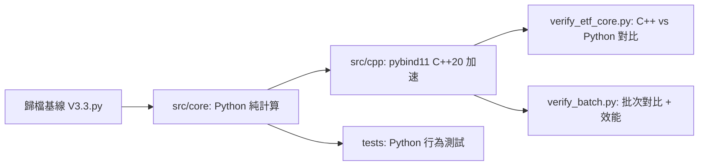

# 形態匹配 ETF 策略 — Python+C++ 混合程式設計重構

[](https://github.com/redamancy231-create/etf-pattern-match-pybind11/actions/workflows/ci.yml)
[](https://www.python.org/)
[](https://en.cppreference.com/)
[](https://cmake.org/)
[](https://github.com/pybind/pybind11)
[](../LICENSE)
[](https://github.com/1c7/chinese-independent-developer)

**語言 / Languages**：正體中文 · [簡體中文](../README.md) · [English](../en/README.md)

[]()
[](../README.md)
[](../en/README.md)

> **English Abstract**: Pure computation modules extracted from a 3,836-line Chinese ETF pattern-matching strategy (V3.3) and accelerated with **pybind11 + C++20**. DTW 34× (96µs→2.8µs), pattern match 53× (14.0ms→0.26ms), batch 2.2× end-to-end. Algorithm logic unchanged — this is a Python/C++ hybrid engineering practice project, not a trading system. 54 tests, 2 verification scripts, interactive Jupyter demo, pip install ready. Full **[English README](../en/README.md)** available.

> ⚡ DTW 96µs→2.8µs (34x) | 形態匹配 14.0ms→0.26ms (53x) | pybind11+C++20 | pip install 即用

## 簡介

本專案從 3836 行中文 ETF 形態匹配策略 V3.3 中提取純計算核心，並使用 **pybind11 + C++20** 進行加速。演算法邏輯不變，目標是驗證 Python/C++ 混合工程實踐——**不是實盤交易系統、不是投資建議、不是策略收益最佳化**。

**適用場景：** pybind11/C++ 加速實踐、量化工程參考、Python/C++ 一致性檢驗。

**不適用場景：** 實盤交易、投資建議、回測收益宣告、策略績效最佳化。

## 加速結果

核心函式單次呼叫加速 34x–53x（100 次計時中位數，5 次 warm-up），批次 C++ 單次 ×100 → C++ 批次 ×1 的介面開銷縮減 2.2x。可復現基準測試詳見 [benchmarks/](../benchmarks/)。

| 函式 | Python | C++ | 加速比 |
|------|--------|-----|--------|
| DTW 距離（L=19） | 96 µs | 2.8 µs | **34×** |
| 形態匹配（單 ETF 單時間點） | 14.0 ms | 0.26 ms | **53×** |
| 批次形態匹配（100 時間點） | 50 ms¹ | 23 ms | **2.2×¹** |

> ¹ 批次行比較的是 100 次 C++ 單次呼叫 vs 1 次 C++ 批次呼叫——衡量批次介面開銷降低，非 Python vs C++ 加速比。

> **詳細分析**：單次呼叫 53× 加速落到批次場景只剩 2.2×——這不是 bug，是 Amdahl's Law。見 [效能分析短文](../docs/performance-analysis.zh-CN.md)。可復現基準測試方法見 [benchmarks/](../benchmarks/)。

### 基準測試範圍

- 平臺：Windows 11, MSVC Release `/O2`
- Python: 3.12.7
- C++: C++20, pybind11 3.0.4
- 驗證：`python verify_etf_core.py` 與 `python verify_batch.py`
- 範圍：僅計算核心加速，非交易效能宣告

## 快速開始

**▶️ [互動演示 Notebook](../notebooks/etf_pattern_matching_demo.ipynb)** — 在 Jupyter 中逐步體驗完整演算法流程。

### pip install（推薦）
```bash
pip install git+https://github.com/redamancy231-create/etf-pattern-match-pybind11.git
```

### 從原始碼構建（cmake）
```bash
# 編譯 C++ 模組
cmake -B build -DPython_EXECUTABLE="<path-to-python.exe>"
cmake --build build --config Release

# 驗證 C++ 與 Python 一致性
python verify_etf_core.py

# 執行測試
python -m pytest tests/ -v

# 啟動互動演示
jupyter notebook notebooks/etf_pattern_matching_demo.ipynb
```

## 專案結構

```
├── src/core/                  # Python 純計算模組（6 個模組，零掘金 SDK 依賴）
│   ├── dtw.py                  # DTW 距離 + 序列標準化
│   ├── pattern_match.py        # 形態匹配引擎（15 維特徵）
│   ├── technical.py            # ADX / ATR / 板塊輪動
│   ├── market_features.py      # 市場環境特徵（F16-F21）
│   ├── risk_controls.py        # 風控規則（純計算）
│   └── metrics.py              # Sortino / Calmar / IC 統計
├── src/cpp/
│   ├── etf_core.cpp            # 統一 C++ 加速模組（8 函式，~1,100 行）
│   └── pyi/etf_core.pyi        # 型別存根
├── tests/                      # 54 項單元測試
├── notebooks/
│   └── etf_pattern_matching_demo.ipynb  # 互動演示（GPT-5.6-Sol 審查）
├── verify_etf_core.py          # C++ vs Python 一致性驗證
├── verify_batch.py             # 批次形態匹配驗證
└── CLAUDE.md                   # 開發筆記與 pybind11 實戰經驗
```



## 常見問題

### 這是交易系統嗎？

不是。本倉庫是一個程式設計實踐專案：從量化策略中提取純計算模組，用 pybind11 + C++20 加速，驗證一致性。

### 為什麼批次加速（2.2x）遠低於單次呼叫加速（53x）？

單次形態匹配測量的是純計算熱路徑。批次匹配包含編排、資料搬運、驗證和 Python/C++ 邊界開銷。預計算視窗快取有幫助，但端到端吞吐量受這些開銷限制。

### 是否依賴掘金 SDK？

不依賴。提取出的 `src/core` 是純計算模組，僅需 NumPy。

### 原始 V3.3.py 在哪裡？

原始策略是父專案的歸檔基線，本倉庫僅保留提取出的計算層、測試和 C++ 加速模組——不含完整平臺繫結策略。

### 能否重跑原始回測？

不能。原始 V3.3 是封存基線，依賴掘金平臺，不在本倉庫範圍內。本專案聚焦工程提取、C++ 加速和一致性驗證。

## 原始來源與範圍

提取自**形態匹配 ETF 策略 V3.3**（歸檔基線，3836 行）。原始策略為周頻 ETF 多頭輪動策略（DTW + 餘弦形態匹配 → RF/SVM Stacking → 多層風控），在掘金平臺回測，覆蓋 2020-2026 年。

**本倉庫包含：**

- 提取的純計算 Python 模組 `src/core/`
- pybind11/C++20 加速模組 `src/cpp/`
- 54 項單元測試 + 2 個驗證指令碼
- 構建配置與開發文件

**本倉庫不包含：**

- 原始平臺繫結策略檔案
- 掘金 SDK 繫結或實盤交易程式碼
- 回測結果或策略績效宣告

## 工具鏈

- Python 3.12.7 + NumPy
- pybind11 3.0.4
- MSVC 19.51（Visual Studio 2026 Community）+ CMake 3.20
- C++20

## 模型分工與審查

| 作者 | 交付 | 審查 |
|------|------|------|
| DeepSeek-V4-Pro | 6 個 Python 模組 + C++ 骨架 + 測試 + 文件 | Kimi + GPT-5.5 |
| Kimi-K2.7-Code | C++ `pattern_match_batch` + 全量 GIL 覆蓋 + batch 契約收斂 + 邊界測試 | GPT-5.5 |

所有原始檔均標註模型來源。

## 關聯專案

| 專案 | 關係 |
|------|------|
| [**AI 協作框架**](https://github.com/redamancy231-create/ai-collaboration-framework) | **方法論上游**——本專案的多後端審查、被動觀測記錄、專案閉合協議均源自該框架 |
| [**Independent Review Toolkit**](https://github.com/redamancy231-create/independent-review-toolkit) | **審查方法來源**——本專案的 Kimi + GPT-5.5 四輪異後端審查使用了該工具包的 SOP |
| [**Prompt-TDD Methodology**](https://github.com/redamancy231-create/prompt-tdd-methodology) | **同級專案**——將對照實驗方法論應用於 prompt 工程；本專案在 pybind11/C++ 混合程式設計方向上應用了類似的方法學嚴謹性 |
| [**M&A Case Study Pipeline**](https://github.com/redamancy231-create/ma-case-study-pipeline) | **同級專案**——多模型學術生產流水線；同樣強調方法的可移植性和跨後端驗證 |
| [**DOCX Pipeline**](https://github.com/redamancy231-create/docx-pipeline) | **同級專案**——Markdown → 中文 DOCX 泛化管道，雙後端 + Mermaid 渲染 |
| [**Claude Skills**](https://github.com/redamancy231-create/claude-skills) | **同級專案**——3 個實戰驗證的 Claude Code Skill，從真實專案工作流提取 |

## 詳細文件

開發筆記與 pybind11 實戰經驗：[CLAUDE.md](../CLAUDE.md) — 構建細節、ABI 排錯、GIL 管理、浮點容差、審查追溯。
